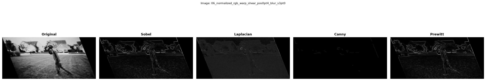
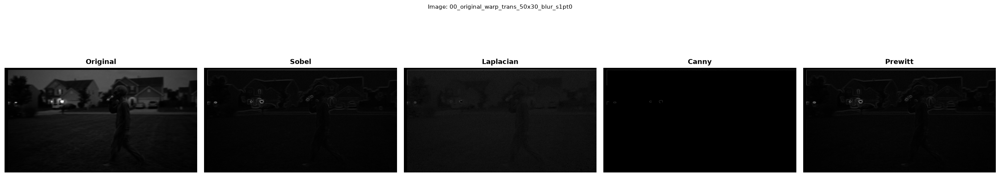
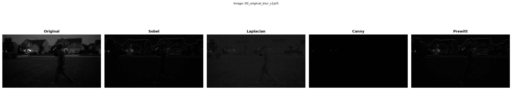
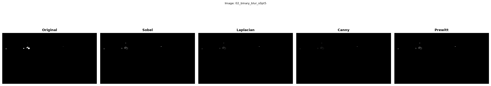
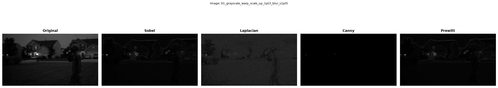
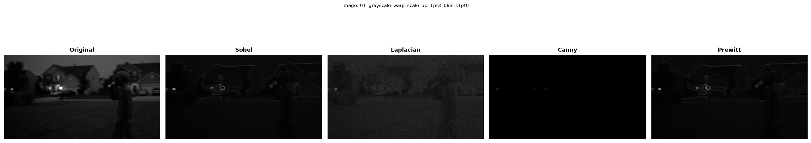
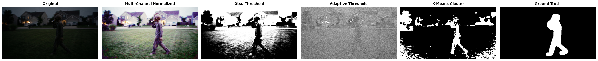

# NitinsaiKaruturi-CS898BA-Project1
**Author:** Nitin Sai Karuturi  
**Course:** CS 898BA – Image Analysis and Computer Vision  
**Assignment:** Homework 1 & Homework 2

---

## Project Overview

This project applies fundamental image analysis, processing, and segmentation 
techniques to an image captured by a doorbell camera. Homework 1 focused on 
color space transformations, affine transformations, blurring, and edge 
detection. Homework 2 builds on this pipeline to isolate the figure in the 
image using classical and optimization-based segmentation techniques.

---

## Setup & Installation

### Requirements
- Python 3.10+
- OpenCV, NumPy, SciPy, Matplotlib

### Install Dependencies
\`\`\`bash
pip install -r requirements.txt
\`\`\`

### Run the Project — Homework 1
Run scripts in this order from the `src/` directory:
\`\`\`bash
python Hello_World.py
python channel_image_statistics.py
python color_spectrum_conversions.py
python luminance_equalizer.py
python spatial_warper.py
python blur_pipeline.py
python subset_partitioner.py
python boundary_extractor.py
python visual_report.py
\`\`\`

### Run the Project — Homework 2
Run scripts in this order from the `src/` directory (after Homework 1 scripts):
\`\`\`bash
python multichannel_normalizer.py
python threshold_segmentation.py
python kmeans_segmentation.py
python segmentation_evaluator.py
python comparison_visualizer.py
\`\`\`

---

## File Descriptions

### Homework 1

| File | Purpose |
|---|---|
| `Hello_World.py` | Initial commit script |
| `channel_image_statistics.py` | Computes min, max, mean, median, mode, skew, range, std, variance per RGB channel |
| `color_spectrum_conversions.py` | Converts image to Grayscale, Binary, HSV, CIELAB, HLS |
| `luminance_equalizer.py` | Normalizes brightness via histogram equalization on HSV V channel |
| `spatial_warper.py` | Applies 14 unique affine transformations across 7 images |
| `blur_pipeline.py` | Applies Gaussian blur at 7 sigma levels to all 21 images |
| `subset_partitioner.py` | Splits 168 images into 4 random subsets of 42 |
| `boundary_extractor.py` | Runs Sobel, Laplacian, Canny, Prewitt edge detection on 42 images |
| `visual_report.py` | Generates 42 comparison plots, saves 6 randomly to readme_plots/ |

### Homework 2

| File | Purpose |
|---|---|
| `multichannel_normalizer.py` | Equalizes all 3 BGR channels independently for full-spectrum normalization |
| `threshold_segmentation.py` | Applies Otsu's global thresholding and Adaptive thresholding segmentation |
| `kmeans_segmentation.py` | Applies K-Means clustering segmentation in HSV color space |
| `segmentation_evaluator.py` | Calculates IoU and Dice Coefficient against a manual ground truth mask |
| `comparison_visualizer.py` | Generates the 6-panel segmentation comparison plot for the README |

---

## Image Count Summary (Homework 1)

| Stage | Images |
|---|---|
| Original image | 1 |
| After color conversions + normalization | 7 |
| After affine transformations | 21 |
| After Gaussian blur pipeline | 168 |
| After edge detection | 210 |

---

# Homework 1: Image Analysis & Computer Vision

## Part 2 Results

### Channel Statistics
The original image was analyzed across all 3 RGB channels.
Each channel showed different intensity distributions reflecting
the dark and low-contrast nature of the doorbell camera image.

### Color Conversions
The image was successfully converted into 5 color spaces:
- **Grayscale** — removes color, keeps luminance
- **Binary** — black and white only using threshold of 127
- **HSV** — separates color (hue) from brightness (value)
- **CIELAB** — perceptual color space mimicking human vision
- **HLS** — separates hue from lightness and saturation

### Lighting Normalization
Histogram equalization was applied to the V channel of the HSV image.
This spread out the brightness values across the full range,
making the image significantly clearer and easier to analyze.

### Gaussian Blur Sigma Analysis

| Sigma | Effect |
|---|---|
| 0.5 | Very subtle blur, fine details preserved |
| 1.0 | Mild smoothing, small textures begin to blend |
| 1.5 | Moderate blur, edges start losing sharpness |
| 2.0 | Noticeable softening, medium detail fades |
| 2.5 | Strong blur, only dominant shapes remain |
| 3.0 | Heavy blur, fine details fully removed |
| 3.5 | Extreme blur, only broad color regions remain |

As sigma increases the Gaussian kernel widens and averages over more
neighboring pixels, progressively removing high frequency detail like
edges and textures while keeping low frequency structure like large shapes.

---

## Part 3 Results

### Edge Detection Analysis

| Technique | Pros | Cons |
|---|---|---|
| **Sobel** | Fast, directional sensitivity, good edge magnitude | Thick edges, sensitive to noise |
| **Laplacian** | Detects edges in all directions, rotation invariant | Very noise sensitive, needs pre-blurring |
| **Canny** | Thin clean edges, noise robust, configurable thresholds | Requires threshold tuning |
| **Prewitt** | Simple, slightly smoother than Sobel | Less accurate than Sobel, less robust than Canny |

### Best Technique for This Image
**Canny** performed best on this image set because the doorbell camera 
image is low contrast and noisy. Canny's built-in Gaussian pre-blur 
and two-threshold hysteresis produced the cleanest and most useful 
edges while suppressing background noise effectively.

---

## Sample Comparison Plots
Each plot shows: Original | Sobel | Laplacian | Canny | Prewitt

---

# Homework 2: Image Segmentation

## Part 2 Results

### Multi-Channel Normalization
All 3 color channels (B, G, R) were independently histogram-equalized
and merged back together. Compared to Homework 1's single-channel (V only)
normalization, this multi-channel approach more aggressively balanced
contrast across all color information, producing a fully normalized
color image used as the input for all segmentation tasks below.

---

## Part 3 & 4 Results

### Segmentation Methods Applied
- **Otsu's Global Thresholding** — automatically calculates a single optimal
  threshold value to separate foreground from background based on the
  grayscale histogram.
- **Adaptive Thresholding (Gaussian)** — calculates a local threshold for
  each region of the image, intended to better handle uneven illumination.
- **K-Means Clustering** — clusters pixels in HSV color space into K groups
  (tested K = 3, 4, 5) and isolates the cluster best matching the figure.
  A Gaussian blur pre-processing step and morphological opening/closing
  cleanup were applied to reduce grass texture noise in the resulting mask.

### Quantitative Results

| Method | IoU | Dice Coefficient |
|---|---|---|
| Otsu Thresholding | 0.0449 | 0.0859 |
| Adaptive Thresholding | 0.0787 | 0.1459 |
| K-Means Clustering | 0.1979 | 0.3305 |

---

## Part 5: Evaluation and Analysis

### Qualitative Analysis

**Otsu Thresholding** performed the worst of the three methods (IoU 0.0449). 
Otsu calculates a single global threshold for the entire image, which struggles 
with this scene's uneven outdoor lighting — the dark grass, varying shadow areas, 
and bright sky all competed for the same brightness range as the figure, causing 
significant background noise to be classified as foreground while parts of the 
figure itself were misclassified as background.

**Adaptive Thresholding** improved on Otsu (IoU 0.0787) by calculating local 
thresholds for small regions rather than one global value, which helped handle 
some of the uneven lighting. However, it still struggled significantly with 
grass texture noise, since the local brightness variation in grass blades was 
similar in scale to the brightness variation at the figure's edges.

**K-Means Clustering** clearly outperformed both threshold-based methods 
(IoU 0.1979, more than double Adaptive's score). By clustering in HSV color 
space rather than relying on simple brightness thresholds, K-Means could 
separate the figure's clothing/skin tones from the grass and sky based on 
hue and saturation differences, not just brightness. Applying Gaussian blur 
before clustering and morphological cleanup (opening/closing) afterward 
further reduced grass texture noise that initially fragmented the mask.

**Impact of multi-channel normalization:** Compared to Homework 1's edge 
detection results (which used only single-channel V normalization), the 
full 3-channel normalization in this assignment produced more balanced 
contrast across the color image, which directly benefited K-Means clustering 
since it depends on color information across all channels. The threshold-based 
methods (Otsu, Adaptive) benefited less from this normalization since they 
only use the grayscale-converted version of the image, discarding the color 
information that multi-channel normalization improved.

**Best performing method:** K-Means clustering was the best performer by a 
clear margin in both IoU and Dice metrics. This matches what we observed 
visually — the K-Means mask preserved a recognizable full-body silhouette 
of the figure, while Otsu and Adaptive masks were dominated by background 
texture noise that overwhelmed the relatively small ground truth figure area.

---

## Comparison Visualization
Each plot shows: Original | Multi-Channel Normalized | Otsu | Adaptive | K-Means | Ground Truth

---

## AI Usage
See [AI_Log.md](AI_Log.md) for full AI usage tracking across both assignments.